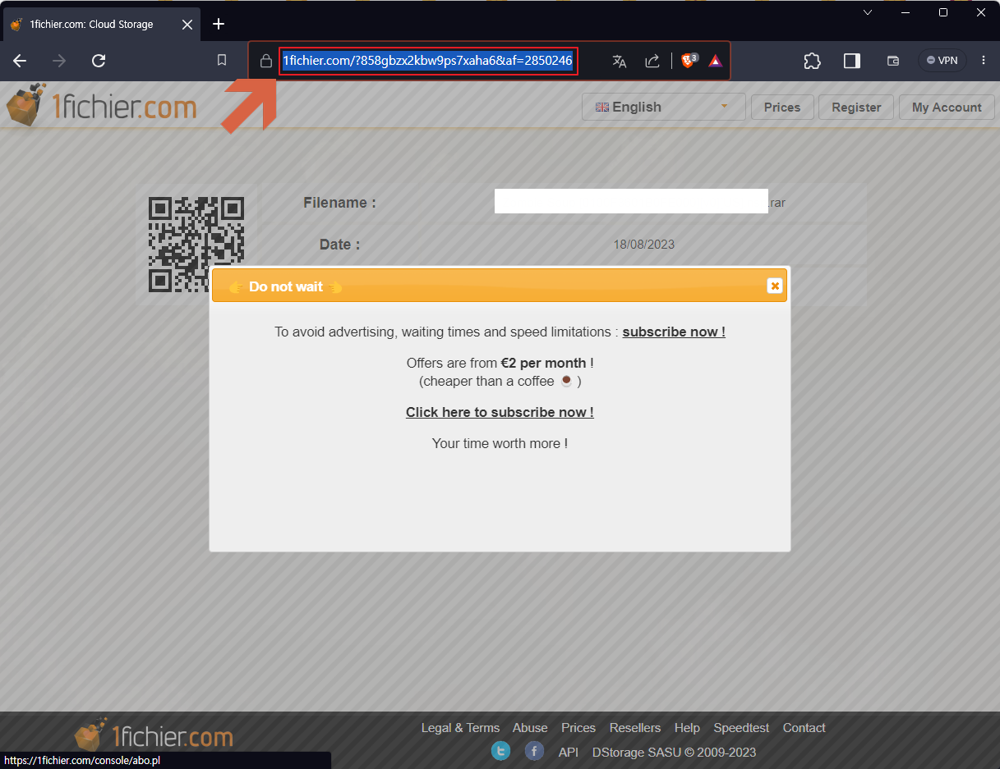
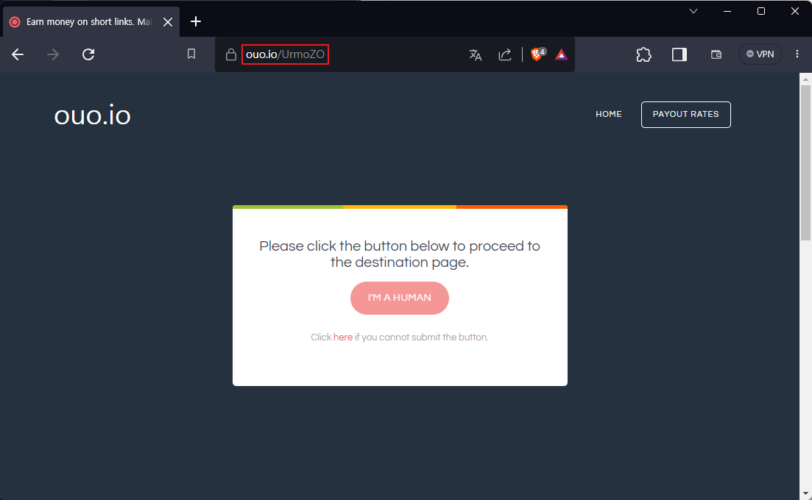
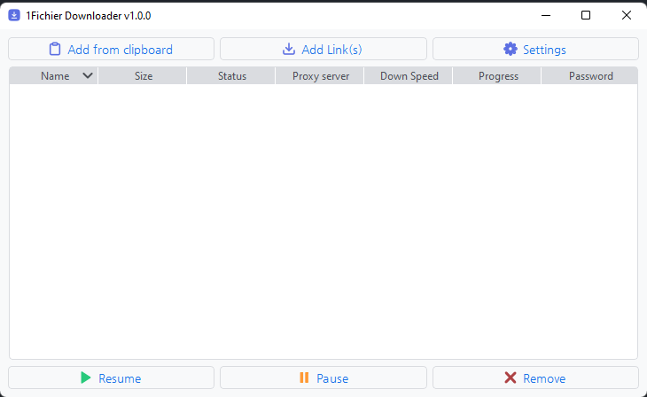
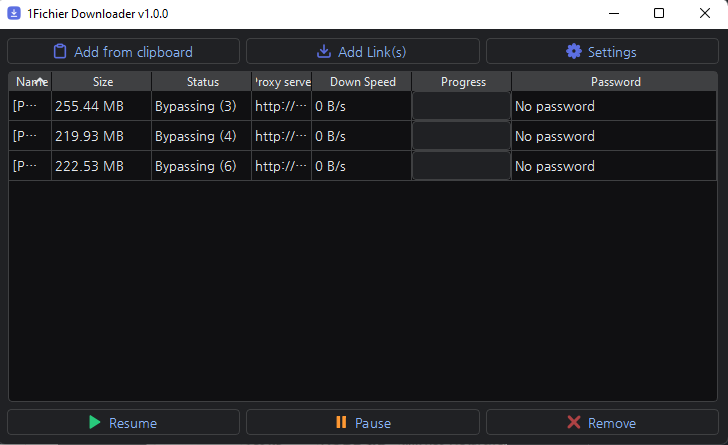
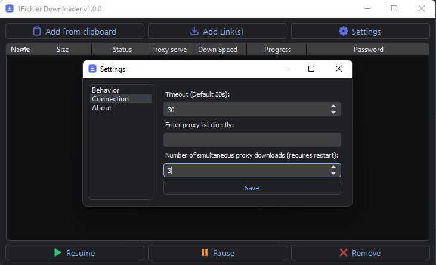
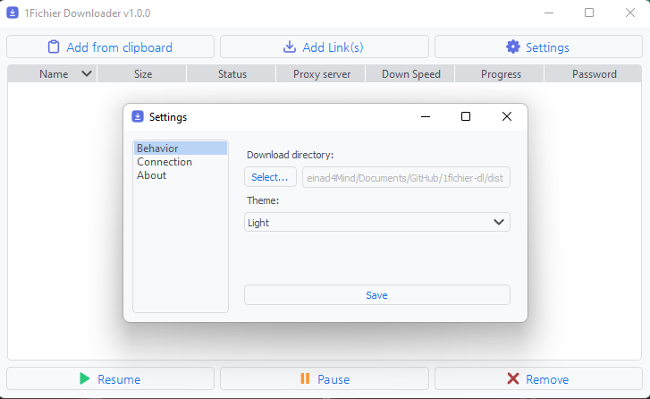
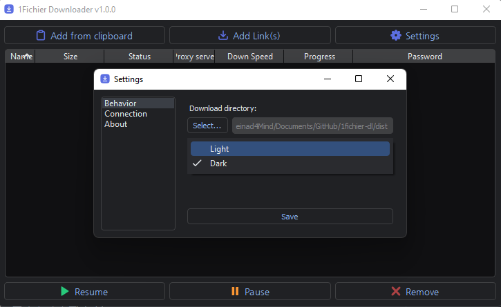

# 1fichier-haters

Fork of the [1Fichier Downloader](https://github.com/jshsakura/1fichier-dl) project. This is a Windows desktop download manager for 1fichier.com links that runs as a standalone `exe`, no installation needed.

<p align="left">
  </img>
</p>

## What it does

- Manages a queue of download links, no need to wait for each one before adding the next.
- Bypasses the wait time free 1fichier accounts normally get stuck with, by rotating through a proxy list.
- Accepts `ouo.io` shortlinks directly and bypasses the reCAPTCHA automatically before resolving the real 1fichier link.
- Lets you supply your own proxy list (HTTPS or SOCKS5) via URL in Settings > Connections, overriding the bundled default list.
- Adds links from clipboard on demand.
- Downloads to the Windows `Downloads` folder by default.

<p align="center">
  </img>
</p>
<p align="center">
  Paste a 1fichier.com link directly into the app.
</p>

<p align="center">
  </img>
</p>
<p align="center">
  Paste an ouo.io shortlink and the reCAPTCHA bypass runs automatically.
</p>

<p align="center">
  </img>
</p>
<p align="center">
  Main queue view: status, progress, and per-item controls.
</p>

<p align="center">
  </img>
</p>
<p align="center">
  </img>
</p>
<p align="center">
  Connection settings: custom proxy list and thread count.
</p>

<p align="center">
  </img>
</p>
<p align="center">Light theme</p>

<p align="center">
  </img>
</p>
<p align="center">Dark theme</p>

## Changes in this fork

- Improved icon color contrast in the GUI.
- Rebuilt the default proxy list bundled with the app.
- Simplified the Windows build to a PyInstaller `onefile` executable.
- The status column now shows the proxy currently in use as `protocol://ip:port`.
- Download progress is shown with decimal precision.
- reCAPTCHA bypass applies to `ouo.io` shortlinks as soon as they're pasted, no manual step needed.
- Fixed a loading-screen glitch and duplicate input handling when adding a link.
- Added "Add from Clipboard".
- Supports simultaneous proxy downloads over multiple threads (default 3, configurable in settings, still experimental).
- Deduplicates links: the same link submitted twice in one paste, or a link already downloading, no longer creates a second entry.

## Known limitations

- Repeated requests through an HTTPS proxy can slow the app down; SOCKS5 support is in testing as a fix.
- Slow proxy servers (sub-100kb/s) are not auto-swapped for a faster one yet.
- Downloads only work with 1fichier.com; other file-hosting sites aren't supported.
- Uses threading rather than asyncio, which limits throughput under heavy concurrent downloads.

## Running from source

Requires Python 3.11. Useful for development, or for running on Linux/Mac where the prebuilt `exe` doesn't apply.

```bash
pip install -r requirements.txt
python 1fichier-dl.py
```

## Running tests

```bash
python -m unittest discover -s tests
```

## Building the Windows exe

```powershell
pyinstaller --windowed --noconsole --onefile --noconfirm --clean --hiddenimport=_cffi_backend --additional-hooks-dir=. --icon=core/gui/res/ico.ico --add-data "core/gui/res/*.*;res/" .\1fichier-dl.py
```

This produces a single-file `exe`. If file paths behave unexpectedly on your machine, build without `--onefile` instead so the output stays a folder rather than a bundled binary.

PyInstaller sometimes gets flagged by antivirus software as a false positive. If you hit that, building PyInstaller itself from source and installing it locally (`pip install .`) tends to resolve it.

## Credits

- Button icons from [Feather](https://feathericons.com/).
- App icon from [svgrepo](https://www.svgrepo.com/).
- Loading overlay icon from [loading.io](https://loading.io).
- Default HTTPS proxy list from [Zaeem20/FREE_PROXIES_LIST](https://github.com/Zaeem20/FREE_PROXIES_LIST).
- Original project by [jshsakura](https://github.com/jshsakura/1fichier-dl), forked and improved by `manuGMG`, forked again here.
- `ouo.io` reCAPTCHA bypass based on work by [xcscxr](https://github.com/xcscxr).
